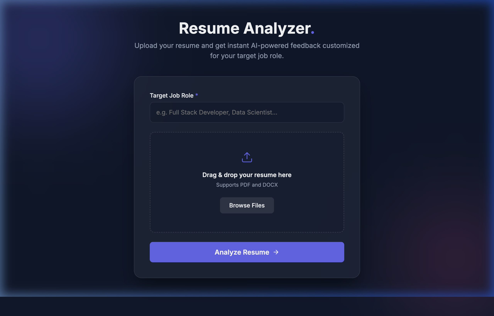
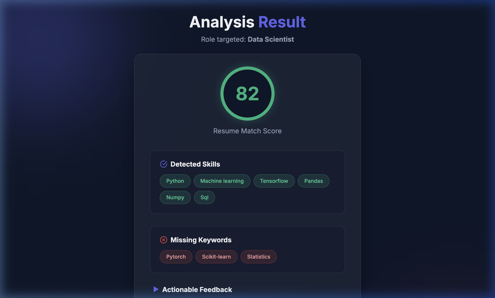

# 🎯 Resume Analyzer AI

> An intelligent, PHP-powered web application that analyzes resumes against target job roles — providing match scores, skill gap detection, and actionable career feedback.

---

## 📸 Screenshots

### 🏠 Homepage — Upload Your Resume



*The clean, dark-themed upload interface lets you enter your target job role and drag-and-drop your resume (PDF or DOCX).*

---

### 📊 Analysis Results Page



*After processing, you get a match score (0–100), detected skills, missing keywords, and personalized feedback — all in a sleek card layout.*

---

## 🚀 Features

- **📤 Resume Upload** — Supports PDF and DOCX formats
- **📝 Text Extraction** — Automatically parses resume content using `smalot/pdfparser` and PHP's `ZipArchive`
- **🎯 Job Role Matching** — Compares your resume against role-specific keyword libraries (Full Stack, Data Scientist, ML Engineer, PHP Developer, etc.)
- **📊 Match Score** — Calculates a 0–100 score based on skills, sections, and resume length
- **🔍 Skill Gap Detection** — Shows detected skills (green) and missing keywords (red)
- **💡 Actionable Feedback** — Personalized suggestions to improve your resume for ATS (Applicant Tracking Systems)
- **💾 Database Storage** — Saves each analysis result to MySQL for future reference
- **🌑 Dark UI** — Premium dark-themed interface with smooth animations

---

## 🛠️ Tech Stack

| Layer        | Technology                          |
|-------------|-------------------------------------|
| Backend      | PHP 8+                             |
| Database     | MySQL (via PDO)                    |
| PDF Parsing  | `smalot/pdfparser` (via Composer)  |
| DOCX Parsing | PHP `ZipArchive`                   |
| Frontend     | HTML5, Vanilla CSS, JavaScript     |
| Local Server | XAMPP (Apache + MySQL)             |
| Fonts        | Google Fonts — Inter               |

---

## 📁 Project Structure

```
php_project/
├── index.php            # Homepage — upload form UI
├── upload.php           # Handles file upload + renders results
├── analyze.php          # Core resume analysis logic
├── db.php               # Database connection (PDO)
├── database.sql         # MySQL schema
├── composer.json        # PHP dependencies
├── assets/
│   ├── css/style.css    # All styles (dark theme, animations)
│   └── js/script.js     # Frontend interactions (drag & drop)
├── uploads/             # Temporary uploaded resume files
└── screenshots/
    ├── homepage.png     # App homepage screenshot
    └── results.png      # Analysis results screenshot
```

---

## ⚙️ Local Setup

### Prerequisites
- [XAMPP](https://www.apachefriends.org/) (Apache + MySQL + PHP)
- [Composer](https://getcomposer.org/)

### Steps

1. **Clone the repository**
   ```bash
   git clone https://github.com/sabari1822/Resume_checker.git
   cd Resume_checker
   ```

2. **Place in XAMPP htdocs**
   ```
   Move project folder to: /Applications/XAMPP/xamppfiles/htdocs/php_project/
   ```

3. **Install PHP dependencies**
   ```bash
   composer install
   ```

4. **Set up the database**
   - Start XAMPP (Apache + MySQL)
   - Open phpMyAdmin: `http://localhost/phpmyadmin`
   - Create a database named `resume_analyzer`
   - Import `database.sql`

5. **Configure database credentials**
   - Edit `db.php` with your MySQL credentials:
   ```php
   $host = 'localhost';
   $dbname = 'resume_analyzer';
   $username = 'root';
   $password = '';  // your XAMPP MySQL password
   ```

6. **Run the app**
   - Open your browser and visit: `http://localhost/php_project/`

---

## 🧠 How It Works

```
User uploads resume (PDF/DOCX)
        ↓
Text extracted from document
        ↓
Resume text matched against job role keyword library
        ↓
Score calculated (Skills 40% + Sections 30% + Length 30%)
        ↓
Results displayed: Score + Skills + Missing Keywords + Feedback
        ↓
Analysis saved to MySQL database
```

---

## 🎯 Supported Job Roles

The analyzer has built-in keyword libraries for:

- Java Developer
- Full Stack Developer
- Frontend Developer
- Backend Developer
- PHP Developer
- Data Scientist
- Machine Learning Engineer
- Web Developer

> For any other role, a generic tech skills checklist is applied.

---

## 📊 Scoring System

| Component       | Weight |
|----------------|--------|
| Skills Match    | 40%    |
| Resume Sections | 30%    |
| Resume Length   | 30%    |

- **75–100** → 🟢 High Match
- **50–74** → 🟡 Medium Match
- **0–49** → 🔴 Low Match

---

## 🗄️ Database Schema

```sql
CREATE TABLE resumes (
    id INT AUTO_INCREMENT PRIMARY KEY,
    filename VARCHAR(255),
    job_role VARCHAR(100),
    extracted_text TEXT,
    score INT,
    missing_keywords JSON,
    feedback JSON,
    created_at TIMESTAMP DEFAULT CURRENT_TIMESTAMP
);
```

---

## 📝 License

This project is open-source and available under the [MIT License](LICENSE).

---

## 👤 Author

**Sabari** — [GitHub @sabari1822](https://github.com/sabari1822)
